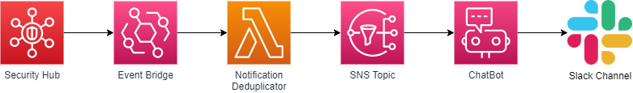

# AWS-SecurityHubNotifications

## Description

This project contains a CloudFormation template for configuring SecurityHub integration with Slack so findings are sent to a configured Slack Channel. The deployed resources track whether a finding has already been notified to Slack so only new findings are sent to the configure channel.

## Deployment

It is recommended to configure a new Slack Channel for the findings.

Follow the instructions under the *Configure a Slack client* section only from the [AWS Blog](https://aws.amazon.com/blogs/security/enabling-aws-security-hub-integration-with-aws-chatbot/) to allow the ChatBot access to your Slack instance.

Run the CloudFormation template in this directory supplying the Slack Channel ID (obtain this from Slack by looking at the Channel Settings) and the Workspace ID (you can find this in the AWS Chatbot). The template should be run in the SecurityHub master account.

## Design

The Solution Design is composed of:

- EventBridge Rule configured to pick up SecurityHub findings of MEDIUM Severity and above targetting a custom Lambda.
- Lambda with logic to determine if the finding needs to be sent to the Slack Channel (sent via SNS topic) or is a duplicate (dropped).
- SNS Topic for new findings.
- Chatbot configured for the Slack Channel.

The Lambda tracks whether a particular finding has already been notified to Slack to prevent duplicate notifications.

In order to do this an additional piece of data is added to the finding via [UserDefinedFields](https://docs.aws.amazon.com/securityhub/latest/userguide/securityhub-findings-format-attributes.html). When a finding is encountered a check is made for a SentToSlack=True key/value pair. If this is found the finding is ignored and no further notification to Slack occurs, if the data is not present then the finding is sent to the ChatBot SNS Topic and the UserDefinedFields data is added.

## Limitations

- As per AWS Chatbot limitations the SMS Topic cannot be encryted.
- To change the Severity of the findings notified requires the template to be changed. 